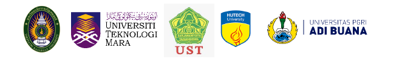

<link rel="stylesheet" href="styles.css" type="text/css">

<!-- ```{r, echo=FALSE, warning=FALSE, layout='l-screen'} -->

<!-- knitr::include_graphics("images/blue-logo.png") -->

<!-- ```   -->

```{=html}
<style>
body {
text-align: justify}
</style>
```
<center>

\
<br> <br> <br>

<h3>
**ONLINE INTERNATIONAL CONFERENCE ON**\
**"TEACHING AND LEARNING IN NEW NORMALITY: A KEY TO EMPOWER TEACHER TOWARDS SUSTAINABLE EDUCATION"**\
\
**20$^{th}$ August 2021**
</h3>

> <h2>
> <ul class="pager"> <!--this is the style of the button-->
> <li><a href=files/conf-registration-form.pdf>**DOWNLOAD CONFERENCE REGISTRATION FORM**</a></li> <!--This button takes me to the table of contents-->
> <li><a href=files/biography-form.pdf>**DOWNLOAD BIOGRAPHY FORM**</a></li> <!--This button takes me to the table of contents-->
> </ul>
> </h2>  

</center>

Thepsatri Rajabhat University is organizing an online international conference on Friday, 20$^{th}$ August 9:00 a.m. to 4.30 p.m. (Thailand Time).

This conference will provide a unique opportunity for TRU's network including lecturers, researchers, practitioners, educators, interested participants and other stakeholders to share their current insightful knowledge and research results on teaching and learning in new normality. *The conference will be driven by a desire to facilitate and navigate researchers during Covid-19 pandemic and to let them stay connected to academic communities*. The conference will encompass oral presentation via zoom video conference with submitted papers with the key current topic:\
\

<center>
<p style="font-family:Serif;font-size:14pt;">
**Teaching and Learning in New Normality: A Key to Empower Teacher towards Sustainable Education**
</p>
</center>

***

**I. Co-hosts** 

1. Universiti Teknologi MARA Kedah Branch, Malaysia\
2. Universitas Sarjanawiyata Tamansiswa, Indonesia\
3. Universitas PGRI Adi Buana Surabaya, Indonesia\
4. Ho Chi Minh City University of Technology, Vietnam\

***

**II. Conference Platform:** 

The conference will take place via Zoom Video Conference with plenary room and session rooms.\
[***Note that: There is no registration fee for the conference.***]{.ul}\

***

**III. How to Participate and Conference Process:** 

1. Fill in the conference registration form provided in order to state that you are willing to participate in this conference. Please send a brief biography with presenter's photograph along with the registration form. Please find the registration form and brief biography at [https://1th.me/PeOaK](https://1th.me/PeOaK).\

2. To facilitate the submission process, the presenters should strictly follow the submission guideline provided at [https://1th.me/PeOaK](https://1th.me/PeOaK).\

3. Submit your registration form and full paper to [ramon.s\@lawasri.tru.ac.th](ramon.s@lawasri.tru.ac.th). After submission, you will be acknowledged for conference acceptance via an email within three working days.\

4. The presenters must prepare a Power Point or any other presentation forms available.\

5. The presenters must present their works by themselves and answer the questions provided by participants. The certificates will be provided after the completion of presentation.\

6. The language available in the oral presentation is English. The presenters will be allocated 20 minutes for presentation and 10 minutes for questions and answers.\

7. After conference date, all the papers will be selected by the scientific and conference committee to be published in our partner journals and undergone a double-blind peer review. The selected papers will be announced within three weeks via email with 'a Letter of Paper Acceptance'. At this point, the presenters need to strictly follow submission guideline and template of a journal that selects your paper for publication. The partner journals will be responsible for publication process.\

8. The papers which are not selected for publication in our partner journals will be published in Proceedings of IACE 2021, Thepsatri Rajabhat University.\

***

**IV. Partner Journals** 

+-----+--------------------------------------------------------------------------------+------------------------------------------------+
|     | Name of Partner Journals                                                       | Name of Publishers                             |
+====:+================================================================================+:==============================================:+
| 1\. | Faculty of Humanity and Social Sciences, Thepsatri Rajabhat University Journal | Thepsatri Rajabhat University                  |
+-----+--------------------------------------------------------------------------------+------------------------------------------------+
| 2\. | Lawarath Social e-Journal Thepsatri Rajabhat University Journal                | Thepsatri Rajabhat University                  |
+-----+--------------------------------------------------------------------------------+------------------------------------------------+
| 3\. | Journal of Creative Practices in Language Learning and Teaching (CPLT)         | Universiti Teknologi MARA                      |
+-----+--------------------------------------------------------------------------------+------------------------------------------------+
| 4\. | Journal of English Language and Language Teaching                              | Universitas Sarjanawiyata Tamansiswa           |
+-----+--------------------------------------------------------------------------------+------------------------------------------------+
| 5\. | Tamansiswa International Journal in Education and Science                      | Universitas Sarjanawiyata Tamansiswa           |
+-----+--------------------------------------------------------------------------------+------------------------------------------------+
| 6\. | Journal of English Language and Pedagogy                                       | Universitas Sarjanawiyata Tamansiswa           |
+-----+--------------------------------------------------------------------------------+------------------------------------------------+
| 7\. | Journal of Technology & Innovation (JTIN)                                      | Ho Chi Minh City University of Technology      |
+-----+--------------------------------------------------------------------------------+------------------------------------------------+
| 8\. | Procedia Social and Behavioral Sciences (Publication fee is required)          | Ho Chi Minh City University of Technology      |
+-----+--------------------------------------------------------------------------------+------------------------------------------------+
| 9\. | Journal of English Teaching Adi Buana (JET Buana)                              | Universitas PGRI Adi Buana Surabaya, Indonesia |
+-----+--------------------------------------------------------------------------------+------------------------------------------------+

***

**V. Important Dates: Process Dates**

+---------------------------------------------+---------------------------------+
| Process                                     | Date                            |
+:===========================================:+:===============================:+
| Paper submission                            | 1st July 2021                   |
+---------------------------------------------+---------------------------------+
| Paper submission deadline                   | 13th August 2021                |
+---------------------------------------------+---------------------------------+
| Acceptance notification of papers           | 18th August 2021                |
+---------------------------------------------+---------------------------------+
| Conference day                              | 20th August 2021                |
+---------------------------------------------+---------------------------------+
| Notification for selected papers            | 6th September 2021              |
+---------------------------------------------+---------------------------------+
| Submission Deadline for revised full papers | It depends on partner journals. |
+---------------------------------------------+---------------------------------+

***

**VI. Overall Conference Schedule Time Speakers**

::: {style="display: flex; "}
::: {.column width="10%"}
:::

::: {.column width="5%"}
  <!-- an empty Div (with a whitespace), serving as
a column separator -->
:::

::: {.column width="40%"}
***Time***
:::

::: {.column width="5%"}
  <!-- an empty Div (with a whitespace), serving as
a column separator -->
:::

::: {.column width="40%"}
***Speakers***
:::
:::

------------------------------------------------------------------------

::: {style="display: flex; "}
::: {.column width="10%"}
:::

::: {.column width="5%"}
  <!-- an empty Div (with a whitespace), serving as
a column separator -->
:::

::: {.column width="40%"}
Morning session\
9:00 a.m. to 12:00 p.m.
:::

::: {.column width="5%"}
  <!-- an empty Div (with a whitespace), serving as
a column separator -->
:::

::: {.column width="40%"}
**Welcome Address**\
by the President of Thepsatri Rajabhat University\
and the administrative representatives from\
co-hosted Universities\
---

**Keynote Speakers**\
*(The names of keynote speakers and topics will be announced later in an abstract booklet on 16th August 2021.)*
:::
:::

------------------------------------------------------------------------

::: {style="display: flex; "}
::: {.column width="10%"}
:::

::: {.column width="5%"}
  <!-- an empty Div (with a whitespace), serving as
a column separator -->
:::

::: {.column width="40%"}
12.00 p.m. to 1.00 p.m.
:::

::: {.column width="5%"}
  <!-- an empty Div (with a whitespace), serving as
a column separator -->
:::

::: {.column width="40%"}
**Lunch Break**
:::
:::

------------------------------------------------------------------------

::: {style="display: flex; "}
::: {.column width="10%"}
:::

::: {.column width="5%"}
  <!-- an empty Div (with a whitespace), serving as
a column separator -->
:::

::: {.column width="85%"}
<center>

In the afternoon, the presentations will be divided into four session rooms\
according to a specific field of study as the following:

</center>
:::
:::

------------------------------------------------------------------------

::: {style="display: flex; "}
::: {.column width="10%"}
:::

::: {.column width="5%"}
  <!-- an empty Div (with a whitespace), serving as
a column separator -->
:::

::: {.column width="40%"}
Afternoon session\
1.00 p.m. - 4.30 p.m.
:::

::: {.column width="5%"}
  <!-- an empty Div (with a whitespace), serving as
a column separator -->
:::

::: {.column width="40%"}
Room 1: Humanities and Social Sciences\
\
Room 2: Science and Technology\
\
Room 3: Education\
\
Room 4: Management
:::
:::

------------------------------------------------------------------------

::: {style="display: flex; "}
::: {.column width="10%"}
:::

::: {.column width="5%"}
  <!-- an empty Div (with a whitespace), serving as
a column separator -->
:::

::: {.column width="85%"}
**Note that**: if there are more six presenters in each session room, an additional session room will be created.
:::
:::

\
\

***

**VII. For more information** 

Please contact:\
Ms. Ramon Suwansawek\
International Relations Officer\
Tel: +66 918876002\
Email: [ramon.s\@lawasri.tru.ac.th](ramon.s@lawasri.tru.ac.th)\
\

***

**VIII. Submission Guidelines** 

\

<center>
<p style="font-family:Serif;font-size:14pt;">
**TITLE OF PAPER**
</p>
<p style="font-family:Serif;font-size:12pt;">
Presenting Author's Name (Surname with Initials)\
Co-Author's Name/s (Surname with Initials)\
*University / Institute , Country*\
*E Mail / Contact Details*\
</p>
</center>
\
<p style="font-family:Serif;font-size:12pt;">
**ABSTRACT**\
An abstract is a single paragraph, without indentation, compendious summary of a paper's substance including research question, background, purpose, methodology, results, and conclusion in 200 to 300 words. An abstract is a single paragraph, without indentation, compendious summary of a paper's substance including research question, background, purpose, methodology, results, and conclusion in 200 to 300 words. An abstract is a single paragraph, without indentation, compendious summary of a paper's substance including research question, background, purpose, methodology, results, and conclusion in 200 to 300 words. An abstract is a single paragraph, without indentation, compendious summary of a paper's substance including research question, background, purpose, methodology, results, and conclusion in 200 to 300 words. An abstract is a single paragraph, without indentation, compendious summary of a paper's substance including research question, background, purpose, methodology, results, and conclusion in 200 to 300 words. An abstract is a single paragraph, without indentation, compendious summary of a paper's substance including research question, background, purpose, methodology, results, and conclusion in 200 to 300 words. An abstract is a single paragraph, without indentation, compendious summary of a paper's substance including research question, background, purpose, methodology, results, and conclusion in 200 to 300 words. An abstract is a single paragraph, without indentation, compendious summary of a paper's substance including research question, background, purpose, methodology, results, and conclusion in 200 to 300 words. An abstract is a single paragraph, without indentation, compendious summary of a paper's substance including research question, background, purpose, methodology, results, and conclusion in 200 to 300 words.\
\
Keywords: Single, Paragraph, Summarizes, words indentation (maximum 6 words)\
\
\
</p>

**Research Paper Preparation**\

Research papers will be submitted to the experts for quality evaluation. Papers for both oral and poster presentations should be 10 to 12 A4 pages long with Times New Roman of 12-point font size. The research components are as follows:\

1. Content  
   1.1 An abstract written in English (A maximum of 1 page of A4 size is required) with 2-5 keywords  
   1.2 Statement of the Problems  
   1.3 Objectives  
   1.4 Scope of the Study  
   1.5 Definitions (if any)  
   1.6 Research Framework (if any)  
   1.7 Research Hypotheses (if any)  
   1.8 Research Methodology  
   
      1.8.1 Population and Sample  
      1.8.2 Research Instruments  
      1.8.3 Data Collection  
      1.8.4 Data Analysis\
   
   1.9 Research Results  
   1.10 Discussions  
   1.11 Recommendations  
   1.12 References  

2. Text Preparation  
   2.1 Paper format must be an A4 sheet with top and left margins of 1.5-inch, bottom and right of 1 inch.  
   2.2 Name of the title must be only 14 pt bold, aligned at the center of the content page. Line and paragraph spacing is single space.  
   2.3 Name(s) of the author and advisor (if any), 12 pt bold, must be typed next to an English title with single space and must be aligned at the right margin.  
   2.4 Footnote consists of an academic title, job position, faculty, major, institution/work place. The footnote font must be 10 pt and placed on the first page.  
   2.5 English abstract font should be 12 pt bold, aligned at the center of the content page. The abstract must be written as "ABSTRACT". The text of the abstract is 12 pt.  
   2.6 Headings of the research components must be 12 pt bold, aligned at the left margin. The text of the paper should be 12 pt.  
   2.7 Indentation must be started at 0.5 inch.  
   2.8 Tables must be prepared in a consistent form and should be numbered consecutively from 1 until the end of the paper. The order of the tables and captions should be at the same line, typed at the top of the table and aligned with the left margin.  
   2.9 Figure must be prepared in a consistent form and should be numbered consecutively from1 until the end of the paper. Place a figure’s order and caption in the same line.  
   2.10 In-text citation must be strictly followed the APA in-text citation style.  
   2.11 References must be APA references style and listed in an alphabetical order.

