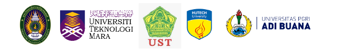

<link rel="stylesheet" href="styles.css" type="text/css">  

<!-- ```{r, echo=FALSE, warning=FALSE, layout='l-screen'} -->
<!-- knitr::include_graphics("images/blue-logo.png") -->
<!-- ```   -->

<center><h1>
**PRESIDENT & RECTOR MESSAGES**  

</h1></center>  

<style>
body {
text-align: justify}
</style>

## {.tabset} 

### **TRU**  

<center>
{width="180"}\
<br> <br> <br> 
**MESSAGE FROM PRESIDENT OF**  
**THEPSATRI RAJABHAT UNIVERSITY**
</center>

<br> 
International partnerships among universities are beneficial to all, ranging from students to staff. The rate of internationalization is increasingly rapid due to various communication channels and inexpensive travel. Evidently, most universities across the world are already seeking to make the most of the possibilities by forming global partnerships and fostering relationships with other institutions. This effort mainly aims to promote students’ and staff’s potential and to strengthen cultures as well as the relationship among university networks.  

Forming international university partnerships offers students an opportunity to learn not only academic and cultural aspects but also life skills. Additionally, it enables universities to better understand the cultures of other nations, thereby facilitating their marketing success there.  

The $4^{th}$ International Academic & Cultural Exchange 2021 (Online) is co-organized by Thepsatri Rajabhat University (TRU), Universiti Teknologi Mara Kedah Branch (UiTM), Universitas Sarjanawiyata Tamansiswa (UST), Ho Chi Minh City University of Technology (HUTECH), and Universitas PGRI Adi Buana Surabaya (UNIPA) in order to provide students and staff from our university networks with valuable opportunities to present and exchange their learning and working outcomes.  

Hopefully, the $4^{th}$ International Academic & Cultural Exchange 2021 (Online) will be successful and productive for all participants and bring such strong friendship among the universities.

\
<center>
{width="180"}\
\
{width="180"}\
Asst. Prof. Chintana Vechmee\
President\
Thepsatri Rajabhat University, Thailand
</center>  

***

### **UiTM KEDAH**  

<center>
{width="180"}\
<br> <br> <br> 
**MESSAGE FROM RECTOR OF**  
**UNIVERSITI TEKNOLOGI MARA KEDAH BRANCH**
</center>

<br> 
First and foremost, my gratitude goes to Thepsatri Rajabhat University, especially to Madam President, Assistant Professor Chintana Vechmee, and to all faculty members and staff. It is an honour for Universiti Teknologi Mara Kedah Branch, Malaysia to be part of the 4th International Academic & Cultural Exchange 2021 (Online). On behalf of UiTM Kedah Branch as the co-organizers, it gives me the utmost joy in welcoming all the participants. A warm welcome is also given to all of the co-organizers - Universitas Sarjanawiyata Tamansiswa (Indonesia), Ho Chi Minh City University of Technology (Vietnam), Universitas Sebelas Maret (Indonesia), and Universitas Papua (Indonesia). I hope IACE 2021 will serve as a platform to network, exchange knowledge and strengthen the existing ties among peers.  

As part of the ASEAN community, the current pandemic situation is an eye opener. Yet, it spearheaded the adoption of online-based education, which include teaching and learning, webinars, conferences, and many more. This conference should be perceived as a stepping-stone for all - academics, researchers, practitioners as well as the public – to discuss and share viewpoints, different arguments, and experiences. I am sure that all of us are looking forward to the conference as the best platform for us to learn more about different fields of study. Let us learn from the presenters in IACE 2021 and exchange ideas in order to build a strong foundation for sustainable future.  

Finally, I wish happy conferencing to all presenters and participants of the $4^{th}$ International Academic & Cultural Exchange 2021 (Online). Thank you.

\
<center>
{width="180"}  
\
Prof. Dr. Mohamad Abdullah Hemdi  
Rektor  
Universiti Teknologi Mara Kedah Branch, Malaysia  
</center>  

***  

### **UST**  

<center>
{width="180"}\
<br> <br> <br> 
**MESSAGE FROM RECTOR OF**  
**UNIVERSITAS SARJANAWIYATA TAMANSISWA**
</center>

<br> 
Honorable President of TRU  
Distinguished Rectors from university partners  
Committee  
Ladies and gentlemen,  

*Assalamualaikum Wr. Wb.  
Salam dan bahagia,*  
Hope everyone is well and blessed, aamiin…  

We are very delighted to participate in the $4^{th}$ International Academic & Cultural Exchange 2021 (Online) hosted by our University Partner, Thepsatri Rajabhat University (TRU), Thailand.  

TRU always creates academic and non-academic activities promoting various and current theme annually. This year, due to Covid-19 outbreaks, IACE brings along online international English speech contest, online international idea pitching competition as well as international webinar.  

We thank very much for the great opportunity to be involved in this inspiring and fruitful event and we eventually wish you all the best. Stay healthy, safe, clean and happy. Thank you.  

With our warmest greetings from Yogyakarta.

\
<center>
{width="180"}\
\
*Wassalamualaikum Wr. Wb.*\
Rector of Universitas Sarjanawiyata Tamansiswa,\
Prof. Drs. H. Pardimin, M.Pd., Ph.D
</center>  

***  

### **HUTECH University**  

<center>
{width="180"}\
<br> <br> <br> 
**MESSAGE FROM VICE RECTOR OF**  
**HO CHI MINH CITY UNIVERSITY OF TECHNOLOGY**
</center>

<br> 
Ladies and gentlemen, Distinguished guests  

I would like to express my sincere appreciation to all the staff from Thepsatri Rajabhat University, Thailand for their great initiative organizing the IACE 2021. I would like to thank all of you who are involved in making this event happen although we have been facing a tough time due to the Covid-19 pandemic.  

Today marks the 4th International Academic & Cultural Exchange 2021 (Online) co-hosted by Thepsatri Rajabhat University, Thailand, Mara University of Technology, Malaysia, Universitas Tanjungpura, Indonesia, Universitas PGRI Adi Buana Surabaya, Indonesia, Universitas Sebelas Maret, Indonesia, and Ho Chi Minh City University of Technology - HUTECH, Vietnam. The IACE 2021 highlights the strong international partnerships among the universities, and it offers the students and staff from the partnered universities an invaluable chance to share their learning outcomes and research findings. Hence, it is strongly believed that this event can be a forum for sharings and discussions, and ultimately it will strengthen the friendship and cooperation among the universities.  

This year, the IACE 2021 focuses on the issue of teaching and learning in new normality: A key to empower teacher towards sustainable education, so this event is supposed to open up discussions for both regional and global perspectives for better understandings and more effective practices in the field of English language teaching and learning. Furthermore, this conference is hoped to address the challenges and opportunities for teaching and learning in new normality.  

I am looking forward to your constructive contributions during the conference, and I wish the IACE 2021 to be successful and fruitful.  

\
<center>
{width="180"}  
\
Assoc. Prof. Dr. Hoang Anh Tuan  
Vice Rector, Ho Chi Minh City University of Technology (HUTECH)  
</center>  

***  

### **UNIVERSITAS PGRI ADI BUANA**  

<center>
{width="180"}\
<br> <br> <br> 
**MESSAGE FROM RECTOR OF**  
**UNIVERSITAS PGRI ADI BUANA SURABAYA**
</center>

<br> 
Warm Greetings  

Dear all,  

It is my honor to greet you from Indonesia. I am so delighted to join the $4^{th}$ International Academic & Cultural Exchange 2021 (Online) among reputable universities in South East Asia. I believe that this great collaboration program will give lots of benefits to us all in terms of academic life and more specifically for our all beloved students.  

This cooperation will provide platforms for our students and lecturers to learn lots from each other in terms of cultures, language, and so on. The students can also share creativity, innovation, information and technology which is beneficial to their future as well as the next generation and the lecturers can have the opportunities to share their working outcomes. So, let us join hand in hand to build brighter education for all in South East Asia.  

Best Regards,

\
<center>
{width="180"}\
\
Dr. M.Subandowo, MS\
Rector\
Universitas PGRI Adi Buana Surabaya, Indonesia
</center>  

